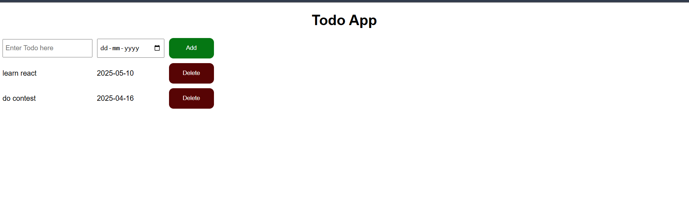

# ✅ Todo App

A simple and clean Todo List Web Application built using **HTML**, **CSS**, and **JavaScript**.

---

## 📋 Features

- Add new todo items with a due date  
- View all tasks in a structured layout  
- Delete tasks once completed  
- Responsive and user-friendly design

---

## 🛠️ Tech Stack

- **HTML** – Structure of the webpage  
- **CSS** – Styling and layout  
- **JavaScript** – Dynamic functionality

---

## 🚀 How to Run

1. Clone this repository or download the ZIP.
2. Open `index.html` in your browser.
3. Type a task and select a due date.
4. Click **Add** to add the task to your list.
5. Click **Delete** to remove any task.

---

## 📸 Screenshot

